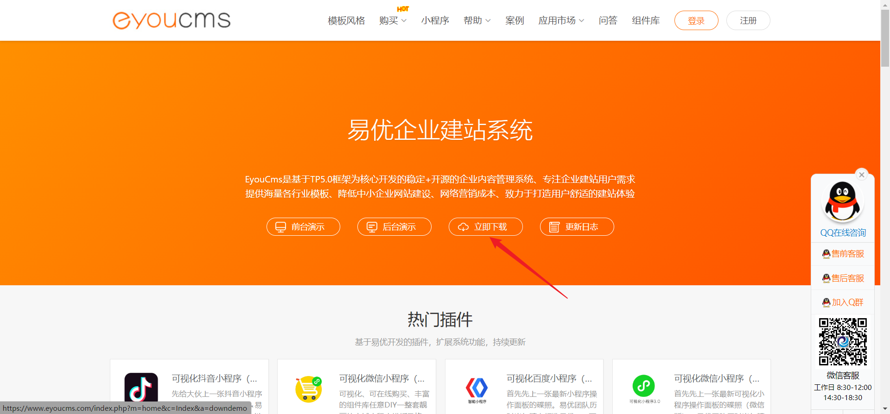
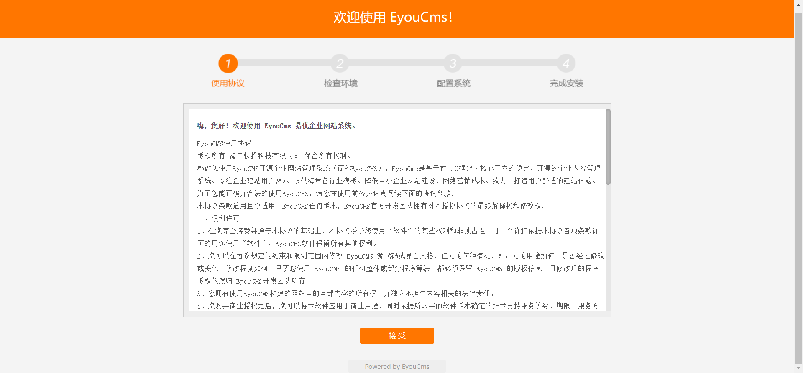
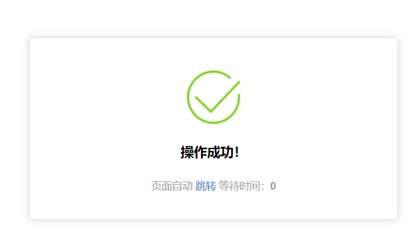

## Reproduction Process

First, download the latest source code from the official website:

After downloading, use PHPStudy Pro to set up the website:

Proceed with the installation process, setting up the database information and admin password:

In the admin panel, verify that the current version is the latest:

Prepare a malicious payload in the form of an image, utilizing Remote Code Execution (RCE) via template file inclusion:

```
GIF89a
<?php phpinfo();?>
```

Upload the image payload:

Choose the WeChat public account interface:

Proceed with the upload and obtain the returned path:


```
uploads/allimg/20230901/1-230Z1151QR14.gif
```
Return to the template configuration, set up security questions:

After configuring security questions, edit the "index.htm" template under the PC section:
Input the following payload:

```
{eyou:include file="uploads/allimg/20230901/1-230Z1151QR14.gif" /}
```
Append it at the end:

After submission:

Return to the homepage, where arbitrary code execution can be observed:


## Code Audit
Firstly, the `eyou:include` tag is present in the list of parsed tags, and there is no filtering mechanism applied to it:
```
core\library\think\Template.php
```

The template file "index.htm" is read and stored in the `$content` variable. Parsing takes place in "core\library\think\Template.php":
We can observe the `parseEyouInclude` function:

Inside this function, the template is analyzed and processed, where we can see that only string operations are performed, and no security risk evaluation is conducted:
Finally, at the end, the tags are replaced and returned:

Due to the absence of security filtering, the include tag's parsing result directly reads and replaces content:

Similarly, in the "Template.php" file, writing to the cache occurs:

Digging deeper:

```
core\library\think\template\driver\File.php
```
In the `write` method, content is directly written:

Cache directory:

Ultimately, in the `read` method of "File.php," the temporarily generated file is included, leading to Remote Code Execution (RCE):

```
core\library\think\template\driver\File.php
```
